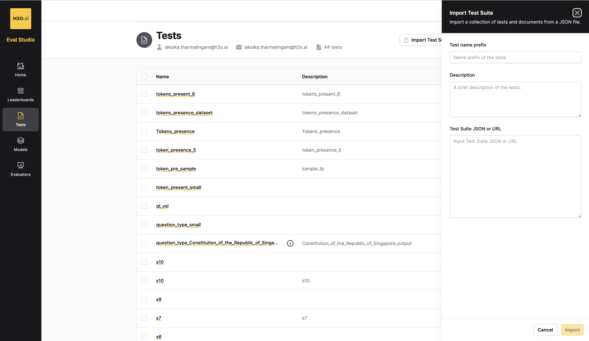
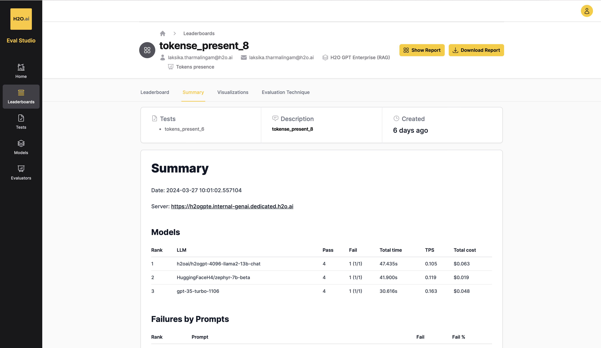

# Using your BYO-evals in H2O EvalStudio💡

Follow this step-by-step guide to use your LLM DataStudio Bring-You-Own evals set to generate evals using H2O EvalStudio:

1. **Access Dataset and Download**: Navigate to the desired dataset folder in the [h2oai/h2o-evals GitHub repository](https://github.com/h2oai/h2o-evals/tree/main/catalog). Each dataset has its own folder containing JSON files. Identify the JSON file corresponding to the evaluation type you want to use and download it. Ensure that the JSON file contains public URLs for accessing the documents if you intend to use the RAG model.

2. **Access EvalStudio**: If you haven't already, sign up for an account on [EvalStudio](https://eval-studio.internal-genai.dedicated.h2o.ai).

3. **Import Test Suite**: In EvalStudio, navigate to the sidebar and select "Tests". Click on "Import test suite" and paste the JSON content into the "Test Suite JSON or URL" field. Then click "Import" to import the test cases.

   

4. **Verify Test Case Import**: Ensure that the test cases are successfully imported.

   

5. **Create Leaderboard**: Proceed to the "Leaderboard" tab and click on "New leaderboard". Select the appropriate options, making sure to choose the correct evaluation type to evaluate the JSON properly. For example, for multiple-choice questions, you can select "answer correctness" or "token presence". Similarly, for question type, choose "answer correctness", and for token presence JSON, select "JSON presence".

   

6. **View Results**: After successfully creating the leaderboard, you can view the results to analyze the evaluation metrics and performance.

   

By following these steps, you can effectively use the evaluation datasets in EvalStudio to conduct evaluations.