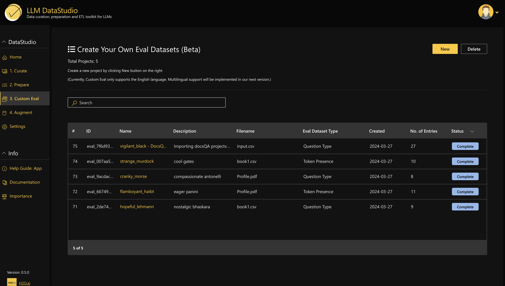
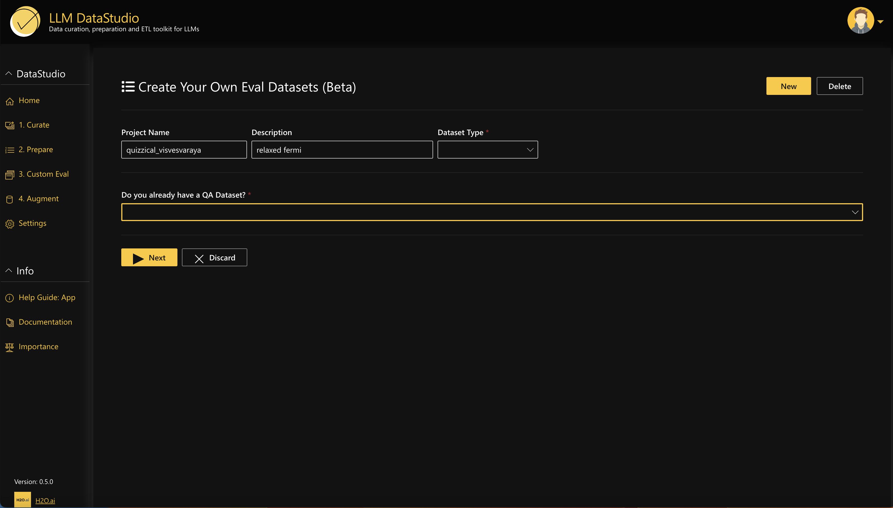
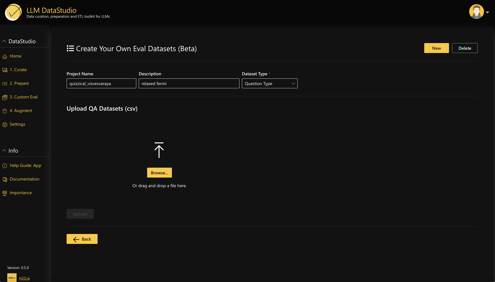
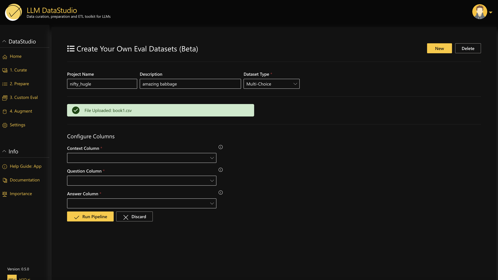
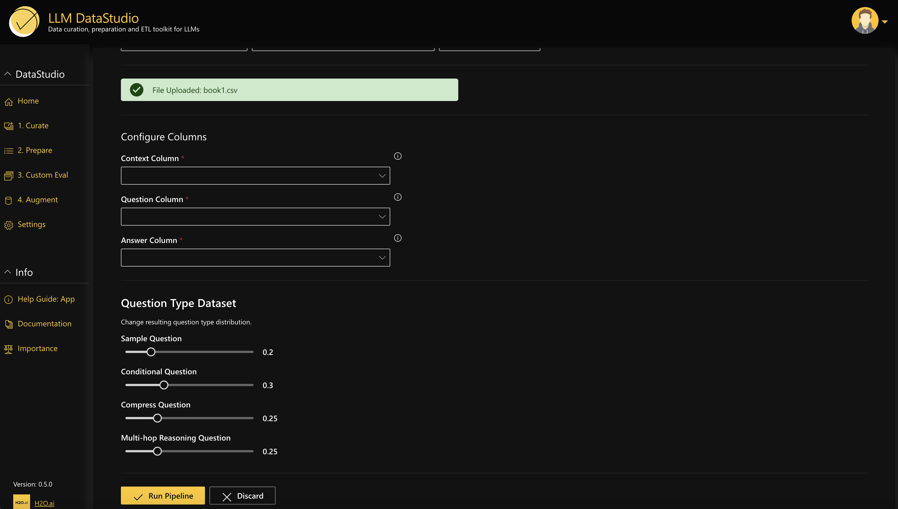
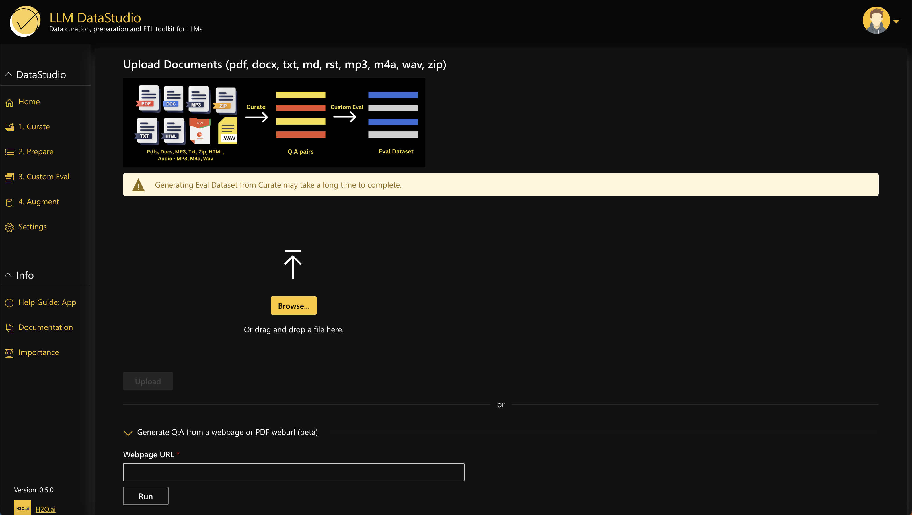
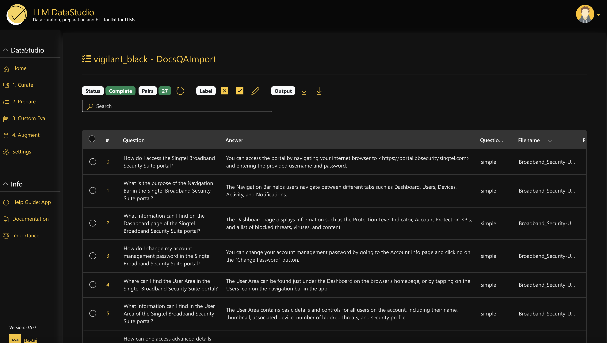

# Create your own Evaluation Dataset using LLM DataStudio 💡

Follow this step-by-step guide to create your own evaluation dataset using LLM DataStudio:

1. **Navigate to Custom Eval**: In LLM DataStudio, locate the sidebar and choose "Custom Eval". Click the "New" button at the top right corner to create a new project.

    

2. **Select Evaluation Dataset Type**: Choose the desired evaluation dataset type such as Question Type, Multichoice or Token presence from the ‘Dataset Type’ option. If you already have a QA dataset in CSV format, select ‘Yes’ from the dropdown. Otherwise, select  ‘No’ and proceed to the next step.

    

3. **Upload QA Dataset (if available)**: If you already have a QA dataset, upload it in CSV format. Then, configure the columns by selecting your context, question and answer columns accordingly.

    

    

4. **Initiate Dataset Creation Process**: If you have selected ‘Question Type’ for the evaluation dataset type, adjust the resulting question type distribution using the slide bars. Proceed by clicking ‘Run pipeline’ to start the dataset creation process.

    

5. **Upload Document Input (if no QA dataset)**: In case you don’t already have a QA dataset, upload any document in formats like PDF, DOC, audio, video file, or input a website URL linking to the document. Then, follow the same process as step 4 to initiate dataset creation.

    

6. **View & Download  Evaluation Dataset**: Once the evaluation dataset is generated, you can view,  edit and tag rows as relevant or irrelevant and download the dataset in CSV or JSON format. (Note:  You can integrate your evaluation datasets into Eval Studio using JSON downloads).

    

By following these steps, you can effectively create your own evaluation datasets in LLM DataStudio.
