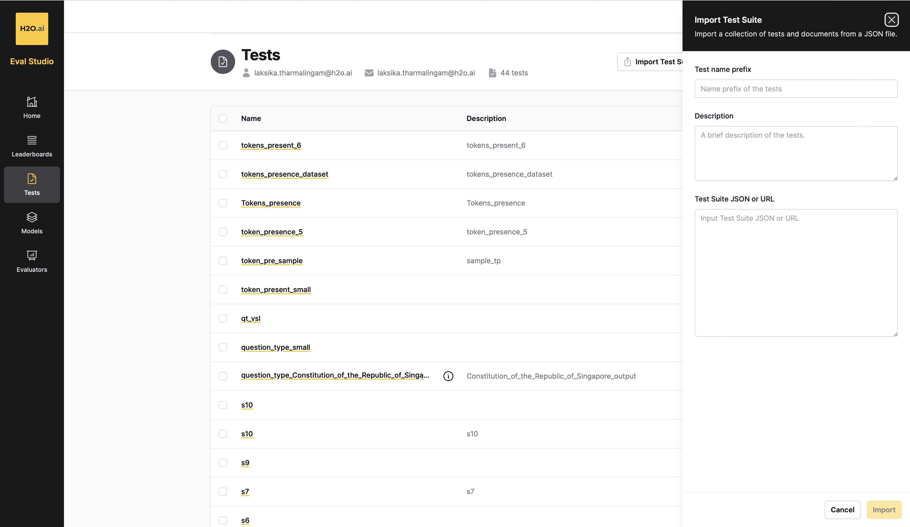
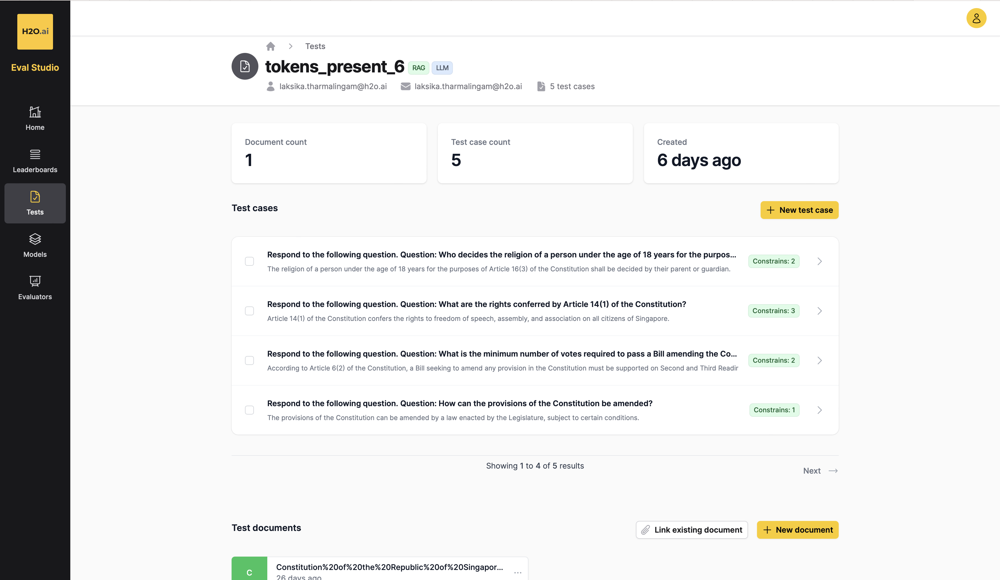
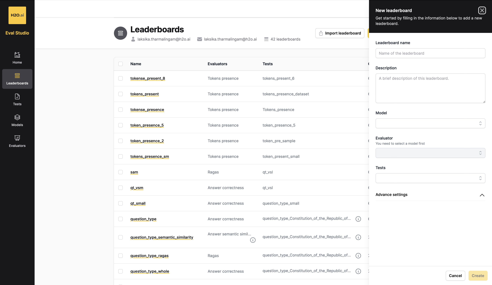
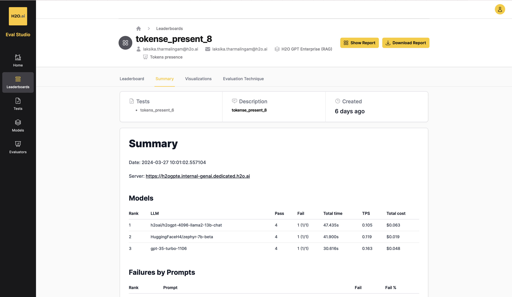

<h1>Eval Datasets </h1>
3️⃣0️⃣ Evaluation Datasets

 
 

## Mission 🚀
To showcase 30 Eval datasets for a range of different industries and types of evaluation for beginners, intermediates as well as experts.

<!-- ## H2O.ai LLM eval Datasets 

H2O Evals is a collection of Large Language Model datasets for a range of different industries and types of evaluation. The evaluation datasets were generated based on a set of documents within each of the different domains. The datasets have been prepared in a way so they can be used to evaluation both LLM and RAG systems. For each evaluation set, metadata is also attached to let you know the documents used. The format of these datasets allow automatic ingestion to H2O Eval Studio to run your own evaluation. 

These datasets were generated using LLM DataStudio which can also be utilized to help you develop your own evaluation datasets.   -->

## H2O.ai LLM Evaluation Datasets 

The evaluation datasets in this collection are for a range of different evaluation types: 

- **Conditional Questions** : The complexity of the question is increased by incorporating a scenario or condition that affects the context of the question.
- **Multi-hop Reasoning Questions** : The complexity of the question is increased, where the question should require the reader to make multiple logical connections or inferences using the information available in given context.
- **Token Presence** : Extract the minimum tokens necessary for accurate answers for the question.

The datasets in this project are generated based on documents for different industries, for example:

- Banking
- Risk Management
- Telecom
- Government
- Legal
- Health
- Finance
- Security

## Available Datasets

Following is the collection of 25 Datasets by different industries, different evaluation types, built in H2O LLM Data Studio. Click on any dataset to get more details.

| # | Dataset Name      | Industry | Sub Industry | No of Entries | Prompt Type |
|---| -------------- | --------- | -------------- | ----- | ----- |
| 1. | [Banking_Financial_Statements_Alphabet_Tesla](https://github.com/h2oai/h2o-evals/tree/main/catalog/Banking_Financial_Statements_Alphabet_Tesla)| `Banking` | Company financial statement | 520 | RAG |
| 2. | [Healthcare_System_in_Singapore](https://github.com/h2oai/h2o-evals/tree/main/catalog/Healthcare_System_in_Singapore)| `Health` | Health | 97 | RAG |
| 3. | [Risk_Management_Policy](https://github.com/h2oai/h2o-evals/tree/main/catalog/Risk_Management_Policy)| `Risk Management` | Risk Management | 160 | RAG |
| 4. | [Telcom_Technical_Report](https://github.com/h2oai/h2o-evals/tree/main/catalog/Telcom_Technical_Report)| `Telecom` | Technical Report | 130 | RAG |
| 5. | [Government_Constitution_of_the_Republic_of_Singapore](https://github.com/h2oai/h2o-evals/tree/main/catalog/Government_Constitution_of_the_Republic_of_Singapore)| `Government` | Government | 160 | RAG |
| 6. | [Healthcare_Health_Service_Standards](https://github.com/h2oai/h2o-evals/tree/main/catalog/Healthcare_Health_Service_Standards)| `Health` | Health Service Standards | 82 | RAG |
| 7. | [Legal_EU_AI_Act](https://github.com/h2oai/h2o-evals/tree/main/catalog/Legal_EU_AI_Act)| `Legal` | EU AI Act | 143 | RAG |
| 8. | [Legal_IRS_Document_1](https://github.com/h2oai/h2o-evals/tree/main/catalog/Legal_IRS_Document_1)| `Legal` | IRS Filing Policy | 145 | RAG |
| 9. | [Legal_IRS_Document_2](https://github.com/h2oai/h2o-evals/tree/main/catalog/Legal_IRS_Document_2)| `Legal` | IRS Filing Policy | 126 | RAG |
| 10. | [Banking_CBA_AnnualReport_2023](https://github.com/h2oai/h2o-evals/tree/main/catalog/Banking_CBA_AnnualReport_2023)| `Banking` | Annual Report | 120 | RAG |
| 11. | [Government_Home_Affairs](https://github.com/h2oai/h2o-evals/tree/main/catalog/Government_Home_Affairs)| `Government` | Home Affairs | 116 | RAG |
| 12. | [Finance_Product_Disclosure_Statement](https://github.com/h2oai/h2o-evals/tree/main/catalog/Finance_Product_Disclosure_Statement)| `Finance` | Product Disclosure Statement | 123 | RAG |
| 13. | [Telcom_Telecommunication_Regulations](https://github.com/h2oai/h2o-evals/tree/main/catalog/Telcom_Telecommunication_Regulations)| `Telecom` | Telecommunications Regulations | 114 | RAG |
| 14. | [Banking_Brokers_Agreement](https://github.com/h2oai/h2o-evals/tree/main/catalog/Banking_Brokers_Agreement)| `Banking` | Brokers Agreement | 58 | RAG |
| 15. | [Security_Singapore_Cyber_Landscape](https://github.com/h2oai/h2o-evals/tree/main/catalog/Security_Singapore_Cyber_Landscape)| `Security` | Singapore Cyber Landscape | 104 | RAG |
| 16. | [Risk_Management_Inherent_Risk_Assessment](https://github.com/h2oai/h2o-evals/tree/main/catalog/Risk_Management_Inherent_Risk_Assessment)| `Risk Management` | Inherent Risk Assessment | 116 | RAG |
| 17. | [Government_Singapore_Labour_Force](https://github.com/h2oai/h2o-evals/tree/main/catalog/Government_Singapore_Labour_Force)| `Government` | Singapore Labour Force | 113 | RAG |
| 18. | [Banking_HSBC_Annual_Report](https://github.com/h2oai/h2o-evals/tree/main/catalog/Banking_HSBC_Annual_Report)| `Banking` | Annual Report | 121 | RAG |
| 19. | [Government_US_Veterans_Affairs](https://github.com/h2oai/h2o-evals/tree/main/catalog/Government_US_Veterans_Affairs)| `Government` | Veterans Affairs | 121 | RAG |
| 20. | [Security_Cyber_Security_Policy](https://github.com/h2oai/h2o-evals/tree/main/catalog/Security_Cyber_Security_Policy)| `Security` | Cyber Security | 125 | RAG |
| 21. | [Risk_Management_Risk_Management_Guidelines](https://github.com/h2oai/h2o-evals/tree/main/catalog/Risk_Management_Risk_Management_Guidelines)| `Risk Management` | Risk Management Guidelines | 123 | RAG |
| 22. | [Telcom_Annual_Report_Singtel](https://github.com/h2oai/h2o-evals/tree/main/catalog/Telcom_Annual_Report_Singtel)| `Telecom` | Annual Report | 153 | RAG |
| 23. | [Legal_IRS_Strategic_Operating_Plan](https://github.com/h2oai/h2o-evals/tree/main/catalog/Legal_IRS_Strategic_Operating_Plan)| `Legal` | IRS Strategic Operating Plan | 128 | RAG |
| 24. | [Government_Immigration_in_Singapore](https://github.com/h2oai/h2o-evals/tree/main/catalog/Government_Immigration_in_Singapore)| `Government` | Immigration in Singapore | 122 | RAG |
| 25. | [Telcom_Telecommunications_regulation_strategy_policy](https://github.com/h2oai/h2o-evals/tree/main/catalog/Telcom_Telecommunications_regulation_strategy_policy)| `Telecom` | Telecommunications Regulations | 116 | RAG |
| 26. | [Healthcare_Stanford_Healthcare_Regulations](https://github.com/h2oai/h2o-evals/tree/main/catalog/Healthcare_Stanford_Healthcare_Regulations)| `Health` | Health Regulations | 114 | RAG |
| 27. | [Banking_Policy_Document](https://github.com/h2oai/h2o-evals/tree/main/catalog/Banking_Policy_Document)| `Banking` | Policy Document | 125 | RAG |
| 28. | [Finance_Financial_Records_Management](https://github.com/h2oai/h2o-evals/tree/main/catalog/Finance_Financial_Records_Management)| `Finance` | Financial Document | 135 | RAG |
| 29. | [Security_Information_Security_Policy](https://github.com/h2oai/h2o-evals/tree/main/catalog/Security_Information_Security_Policy)| `Security` | Information Security Policy | 146 | RAG |
| 30. | [Government_Defense_Management](https://github.com/h2oai/h2o-evals/tree/main/catalog/Government_Defense_Management)| `Government` | Defense Management | 137 | RAG |

## Using the Dataset in EvaStudio 📊

To utilize these evaluation datasets in EvaStudio for your own evaluations, follow these steps:

1. **Access Dataset and Download**: Navigate to the desired dataset folder in the [h2oai/h2o-evals GitHub repository](https://github.com/h2oai/h2o-evals/tree/main/catalog). Each dataset has its own folder containing JSON files. Identify the JSON file corresponding to the evaluation type you want to use and download it. Ensure that the JSON file contains public URLs for accessing the documents if you intend to use the RAG model.

2. **Access EvaStudio**: If you haven't already, sign up for an account on [EvaStudio](https://eval-studio.internal-genai.dedicated.h2o.ai).

3. **Import Test Suite**: In EvaStudio, navigate to the sidebar and select "Tests". Click on "Import test suite" and paste the JSON content into the "Test Suite JSON or URL" field. Then click "Import" to import the test cases.

   

4. **Verify Test Case Import**: Ensure that the test cases are successfully imported.

   

5. **Create Leaderboard**: Proceed to the "Leaderboard" tab and click on "New leaderboard". Select the appropriate options, making sure to choose the correct evaluation type to evaluate the JSON properly. For example, for multiple-choice questions, you can select "answer correctness" or "token presence". Similarly, for question type, choose "answer correctness", and for token presence JSON, select "JSON presence".

   

6. **View Results**: After successfully creating the leaderboard, you can view the results to analyze the evaluation metrics and performance.

   

By following these steps, you can effectively use the evaluation datasets in EvaStudio to conduct evaluations.

## Contribution 🛠️
Please create an [Issue](https://github.com/h2oai/h2o-evals/issues) for any improvements, suggestions or errors in the content.