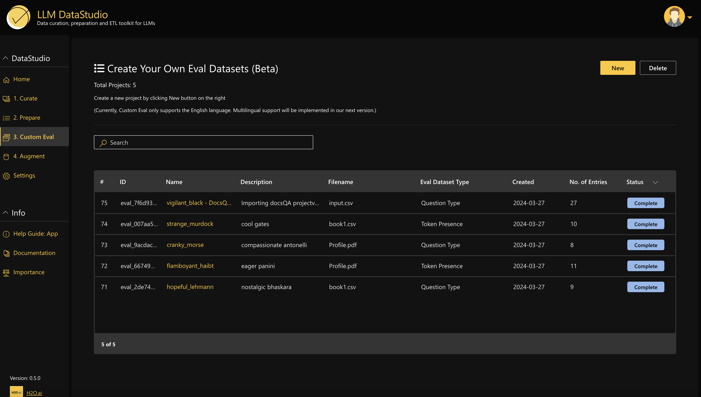

<h1>Eval Datasets </h1>
4️⃣0️⃣ Evaluation Datasets

 
 

## Mission 🚀
To showcase 40 Eval datasets for a range of different industries and types of evaluation for beginners, intermediates as well as experts.

<!-- ## H2O.ai LLM eval Datasets 

H2O Evals is a collection of Large Language Model datasets for a range of different industries and types of evaluation. The evaluation datasets were generated based on a set of documents within each of the different domains. The datasets have been prepared in a way so they can be used to evaluation both LLM and RAG systems. For each evaluation set, metadata is also attached to let you know the documents used. The format of these datasets allow automatic ingestion to H2O Eval Studio to run your own evaluation. 

These datasets were generated using LLM DataStudio which can also be utilized to help you develop your own evaluation datasets.   -->

## H2O.ai LLM Evaluation Datasets 

The evaluation datasets in this collection are for a range of different evaluation types: 

- **Conditional Questions** : The complexity of the question is increased by incorporating a scenario or condition that affects the context of the question.
- **Multi-hop Reasoning Questions** : The complexity of the question is increased, where the question should require the reader to make multiple logical connections or inferences using the information available in given context.
- **Token Presence** : Extract the minimum tokens necessary for accurate answers for the question.

The datasets in this project are generated based on documents for different industries, for example:

- Banking
- Risk Management
- Telecom
- Government
- Legal
- Health
- Finance
- Security

## Available Datasets

Following is the collection of 40 Datasets by different industries, different evaluation types, built in H2O LLM Data Studio. Click on any dataset to get more details.

| # | Dataset Name      | Industry | Sub Industry | No of Entries | Prompt Type |
|---| -------------- | --------- | -------------- | ----- | ----- |
| 1. | [Banking_Financial_Statements_Alphabet_Tesla](https://github.com/h2oai/h2o-evals/tree/main/catalog/Banking_Financial_Statements_Alphabet_Tesla)| `Banking` | Company financial statement | 520 | RAG |
| 2. | [Healthcare_System_in_Singapore](https://github.com/h2oai/h2o-evals/tree/main/catalog/Healthcare_System_in_Singapore)| `Health` | Health | 97 | RAG |
| 3. | [Risk_Management_Policy](https://github.com/h2oai/h2o-evals/tree/main/catalog/Risk_Management_Policy)| `Risk Management` | Risk Management | 160 | RAG |
| 4. | [Telcom_Technical_Report](https://github.com/h2oai/h2o-evals/tree/main/catalog/Telcom_Technical_Report)| `Telecom` | Technical Report | 130 | RAG |
| 5. | [Government_Constitution_of_the_Republic_of_Singapore](https://github.com/h2oai/h2o-evals/tree/main/catalog/Government_Constitution_of_the_Republic_of_Singapore)| `Government` | Government | 160 | RAG |
| 6. | [Healthcare_Health_Service_Standards](https://github.com/h2oai/h2o-evals/tree/main/catalog/Healthcare_Health_Service_Standards)| `Health` | Health Service Standards | 82 | RAG |
| 7. | [Legal_EU_AI_Act](https://github.com/h2oai/h2o-evals/tree/main/catalog/Legal_EU_AI_Act)| `Legal` | EU AI Act | 143 | RAG |
| 8. | [Legal_IRS_Document_1](https://github.com/h2oai/h2o-evals/tree/main/catalog/Legal_IRS_Document_1)| `Legal` | IRS Filing Policy | 145 | RAG |
| 9. | [Legal_IRS_Document_2](https://github.com/h2oai/h2o-evals/tree/main/catalog/Legal_IRS_Document_2)| `Legal` | IRS Filing Policy | 126 | RAG |
| 10. | [Banking_CBA_AnnualReport_2023](https://github.com/h2oai/h2o-evals/tree/main/catalog/Banking_CBA_AnnualReport_2023)| `Banking` | Annual Report | 120 | RAG |
| 11. | [Government_Home_Affairs](https://github.com/h2oai/h2o-evals/tree/main/catalog/Government_Home_Affairs)| `Government` | Home Affairs | 116 | RAG |
| 12. | [Finance_Product_Disclosure_Statement](https://github.com/h2oai/h2o-evals/tree/main/catalog/Finance_Product_Disclosure_Statement)| `Finance` | Product Disclosure Statement | 123 | RAG |
| 13. | [Telcom_Telecommunication_Regulations](https://github.com/h2oai/h2o-evals/tree/main/catalog/Telcom_Telecommunication_Regulations)| `Telecom` | Telecommunications Regulations | 114 | RAG |
| 14. | [Banking_Brokers_Agreement](https://github.com/h2oai/h2o-evals/tree/main/catalog/Banking_Brokers_Agreement)| `Banking` | Brokers Agreement | 58 | RAG |
| 15. | [Security_Singapore_Cyber_Landscape](https://github.com/h2oai/h2o-evals/tree/main/catalog/Security_Singapore_Cyber_Landscape)| `Security` | Singapore Cyber Landscape | 104 | RAG |
| 16. | [Risk_Management_Inherent_Risk_Assessment](https://github.com/h2oai/h2o-evals/tree/main/catalog/Risk_Management_Inherent_Risk_Assessment)| `Risk Management` | Inherent Risk Assessment | 116 | RAG |
| 17. | [Government_Singapore_Labour_Force](https://github.com/h2oai/h2o-evals/tree/main/catalog/Government_Singapore_Labour_Force)| `Government` | Singapore Labour Force | 113 | RAG |
| 18. | [Banking_HSBC_Annual_Report](https://github.com/h2oai/h2o-evals/tree/main/catalog/Banking_HSBC_Annual_Report)| `Banking` | Annual Report | 121 | RAG |
| 19. | [Government_US_Veterans_Affairs](https://github.com/h2oai/h2o-evals/tree/main/catalog/Government_US_Veterans_Affairs)| `Government` | Veterans Affairs | 121 | RAG |
| 20. | [Security_Cyber_Security_Policy](https://github.com/h2oai/h2o-evals/tree/main/catalog/Security_Cyber_Security_Policy)| `Security` | Cyber Security | 125 | RAG |
| 21. | [Risk_Management_Risk_Management_Guidelines](https://github.com/h2oai/h2o-evals/tree/main/catalog/Risk_Management_Risk_Management_Guidelines)| `Risk Management` | Risk Management Guidelines | 123 | RAG |
| 22. | [Telcom_Annual_Report_Singtel](https://github.com/h2oai/h2o-evals/tree/main/catalog/Telcom_Annual_Report_Singtel)| `Telecom` | Annual Report | 153 | RAG |
| 23. | [Legal_IRS_Strategic_Operating_Plan](https://github.com/h2oai/h2o-evals/tree/main/catalog/Legal_IRS_Strategic_Operating_Plan)| `Legal` | IRS Strategic Operating Plan | 128 | RAG |
| 24. | [Government_Immigration_in_Singapore](https://github.com/h2oai/h2o-evals/tree/main/catalog/Government_Immigration_in_Singapore)| `Government` | Immigration in Singapore | 122 | RAG |
| 25. | [Telcom_Telecommunications_regulation_strategy_policy](https://github.com/h2oai/h2o-evals/tree/main/catalog/Telcom_Telecommunications_regulation_strategy_policy)| `Telecom` | Telecommunications Regulations | 116 | RAG |
| 26. | [Healthcare_Stanford_Healthcare_Regulations](https://github.com/h2oai/h2o-evals/tree/main/catalog/Healthcare_Stanford_Healthcare_Regulations)| `Health` | Health Regulations | 114 | RAG |
| 27. | [Banking_Policy_Document](https://github.com/h2oai/h2o-evals/tree/main/catalog/Banking_Policy_Document)| `Banking` | Policy Document | 125 | RAG |
| 28. | [Finance_Financial_Records_Management](https://github.com/h2oai/h2o-evals/tree/main/catalog/Finance_Financial_Records_Management)| `Finance` | Financial Document | 135 | RAG |
| 29. | [Security_Information_Security_Policy](https://github.com/h2oai/h2o-evals/tree/main/catalog/Security_Information_Security_Policy)| `Security` | Information Security Policy | 146 | RAG |
| 30. | [Government_Defense_Management](https://github.com/h2oai/h2o-evals/tree/main/catalog/Government_Defense_Management)| `Government` | Defense Management | 137 | RAG |
| 31. | [Legal_Employment_Contract](https://github.com/h2oai/h2o-evals/tree/main/catalog/Legal_Employment_Contract)| `Legal` | Employment Contract | 60 | RAG |
| 32. | [Healthcare_Digital_Health_Guidelines](https://github.com/h2oai/h2o-evals/tree/main/catalog/Healthcare_Digital_Health_Guidelines)| `Health` | Digital Health Guidelines | 127 | RAG |
| 33. | [Risk_Management_Risk_Management_Techniques_Tool](https://github.com/h2oai/h2o-evals/tree/main/catalog/Risk_Management_Risk_Management_Techniques_Tool)| `Risk Management` | Risk Management | 120 | RAG |
| 34. | [Telcom_Telecom_Infrastructure_Planning](https://github.com/h2oai/h2o-evals/tree/main/catalog/Telcom_Telecom_Infrastructure_Planning)| `Telecom` | Telecom Infrastructure Planning | 153 | RAG |
| 35. | [Banking_Banking_Act](https://github.com/h2oai/h2o-evals/tree/main/catalog/Banking_Banking_Act)| `Banking` | Banking Act | 148 | RAG |
| 36. | [Finance_IMF_Financial_Statements](https://github.com/h2oai/h2o-evals/tree/main/catalog/Finance_IMF_Financial_Statements)| `Finance` | Financial Statement | 126 | RAG |
| 37. | [Security_Information_Security](https://github.com/h2oai/h2o-evals/tree/main/catalog/Security_Information_Security)| `Security` | Information Security  | 125 | RAG |
| 38. | [Government_SA_Home_Affairs](https://github.com/h2oai/h2o-evals/tree/main/catalog/Government_SA_Home_Affairs)| `Government` | Home Affairs | 140 | RAG |
| 39. | [Healthcare_Maternal_Child_Healthcare](https://github.com/h2oai/h2o-evals/tree/main/catalog/Healthcare_Maternal_Child_Healthcare)| `Health` | Maternal Child Healthcare | 147 | RAG |
| 40. | [Legal_UPC_Agreement](https://github.com/h2oai/h2o-evals/tree/main/catalog/Legal_UPC_Agreement)| `Legal` | UPC Agreement | 141 | RAG |

### Create your own Evaluation Dataset using LLM DataStudio 💡

If you're interested in creating your own evaluation dataset using LLM DataStudio, you can follow the step-by-step guide provided in our [dataset creation guide](https://github.com/h2oai/h2o-evals/blob/main/LLMDataStudio_README.md).

## Using the Dataset in EvalStudio 📊

Bring-your-own Evals from LLM DataStudio seamlessly integrates in H2O EvalStudio. To utilize these datasets in EvalStudio for your own evaluations, follow the steps in the [evaluation creation guide]

## Contribution 🛠️
Please create an [Issue](https://github.com/h2oai/h2o-evals/issues) for any improvements, suggestions or errors in the content.

[def]: https://github.com/h2oai/h2o-evals/blob/main/EvalStudio_README.md